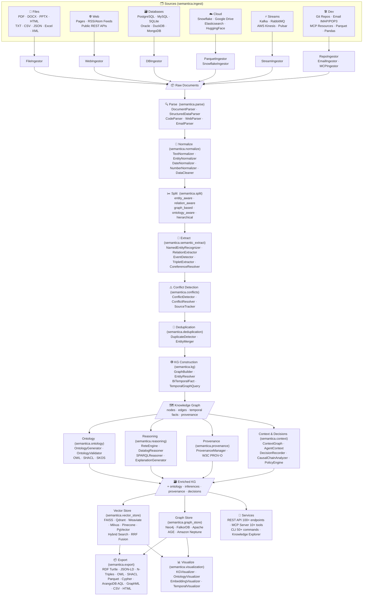

# Semantica — Architecture

Complete data flow from every source type to every final output, and the decision intelligence lifecycle.

---

## Full Data Pipeline

Every source, every processing step, every final artifact — in one diagram.

---

## Decision Intelligence Lifecycle

```mermaid
flowchart LR
    subgraph RECORD["1️⃣  Record"]
        R1["record_decision()\ncategory · scenario\nreasoning · outcome\nconfidence · metadata"]
    end

    subgraph LINK["2️⃣  Link"]
        L1["add_causal_relationship()\ntriggers · enables\ncauses · precedes"]
    end

    subgraph QUERY["3️⃣  Query"]
        Q1["find_similar_decisions()\nSemantic precedent search"]
        Q2["trace_decision_chain()\nFull causal ancestry"]
        Q3["analyze_decision_impact()\nDownstream influence map"]
    end

    subgraph GOVERN["4️⃣  Govern"]
        G1["check_decision_rules()\nPolicy evaluation\nCompliance gate"]
    end

    subgraph AUDIT["5️⃣  Audit Export"]
        A1["W3C PROV-O  ·  CSV  ·  JSON\nRegulator-ready audit trail"]
    end

    RECORD -->|decision_id| LINK
    LINK   -->|causal graph| QUERY
    QUERY  -->|results| GOVERN
    GOVERN -->|signed-off decisions| AUDIT
```

---

*→ [README](README.md) · [Docs](https://docs.getsemantica.ai/) · [Cookbook](https://github.com/semantica-agi/semantica/tree/main/cookbook)*

> Note: `Docs` and `Cookbook` are external resources maintained outside this file and may change over time. If a link is unavailable, refer to the repository `README.md` and in-repo documentation as canonical fallbacks.
