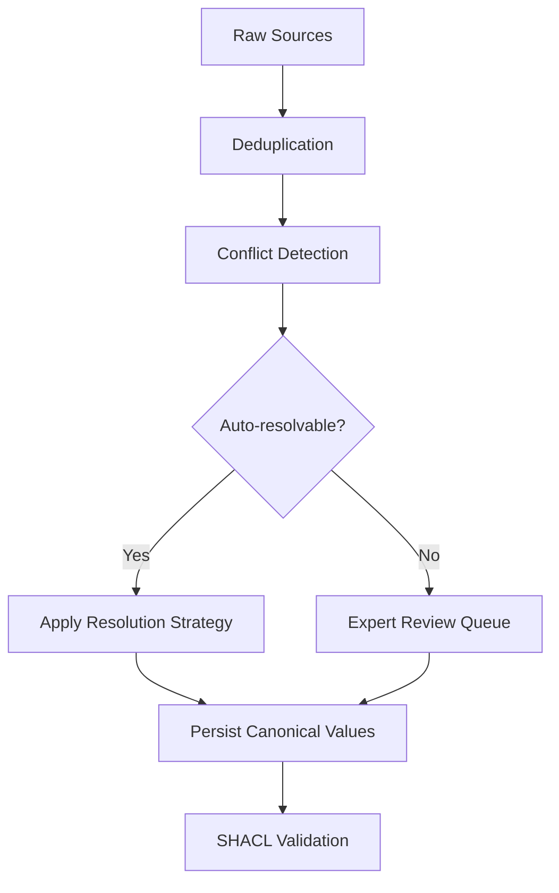

`ConflictDetector` surfaces properties where multiple sources disagree on the same canonical entity, and `ConflictResolver` applies per-property strategies — credibility-weighted voting, most-recent, expert review, and others — to produce a single resolved value with a full audit trail. Run it after deduplication and before SHACL validation.

<Info>
Run conflict detection after deduplication and before SHACL validation. Deduplication removes duplicate nodes; conflict resolution reconciles disagreeing property values on the same canonical entity. Running them out of order — detecting conflicts before deduplication — will produce spurious conflicts between entities that should have been merged first.
</Info>

## What Is Conflict Resolution?

When you merge data from multiple sources, the same real-world entity — a customer, a product, a threat actor, a drug compound — often appears with contradictory property values. One database says a customer's email is `alice@example.com`; another says `alice.smith@example.com`. One security feed rates a CVE at 10.0; two others rate it 9.1 and 9.5.

**Conflict resolution** is the systematic process of deciding which value is most trustworthy and recording that decision with evidence, so the canonical entity ends up with one defensible, auditable value per property.

### Key Concepts

**Canonical entity** — The single authoritative record for a real-world thing. After deduplication, each entity has exactly one canonical node in your graph. Conflict resolution determines which property values belong on that node.

**Conflicting values** — Two or more different values asserted for the same property on the same canonical entity, each reported by a different source.

**Credibility score** — A number between 0.0 and 1.0 you attach to each source record, indicating how reliable that source is. A government registry might carry 0.99; a scraped blog might carry 0.30. You supply these; Semantica uses them during `CREDIBILITY_WEIGHTED` resolution.

**Confidence score** — A number between 0.0 and 1.0 the resolver *computes* after resolution, reflecting how certain the outcome is. A unanimous vote produces high confidence; a close split among equally credible sources produces lower confidence. This appears on `ResolutionResult.confidence` and should be read as a signal, not a guarantee that the resolved value is correct.

**Resolution strategy** — The rule for picking the winning value: majority vote, credibility-weighted average, latest timestamp, and so on. See [Resolution strategies at a glance](#resolution-strategies-at-a-glance) for the full list.

**Audit trail** — The complete record of every resolution decision: conflict ID, strategy used, resolved value, sources consulted, and confidence score. Returned by `resolver.get_resolution_history()`.

**Provenance-aware resolution** — Resolution that records not just the winning value but which source it came from. Every `ResolutionResult` carries a `sources_used` field, so you can always trace a canonical value back to its origin — critical in regulated environments.

## Why Use Conflict Resolution?

- **Multi-source pipelines always produce disagreements.** Differences in update cadence, data-entry conventions, and source reliability are unavoidable. Without an explicit resolution step, you silently favor one source over another with no record of the choice.
- **You get a defensible, auditable decision log.** Compliance teams, auditors, and domain experts need to know which source won and why. The audit trail provides exactly that.
- **Easy cases are automated; hard cases are escalated.** Routine disagreements — slightly different name spellings, stale timestamps — are resolved algorithmically. Genuinely ambiguous cases — competing legal classifications, different clinical endpoints — are flagged for expert review without blocking the rest of the pipeline.

## When To Use / When Not To Use

**Use conflict resolution when:**
- You are merging two or more independent sources for the same entity.
- Sources disagree on property values and you need a single canonical value.
- You need an auditable record of every resolution decision.
- Some conflicts require domain-expert review before they can be resolved.

**Skip conflict resolution when:**
- **A single authoritative source already exists.** If one system is always correct for a given property, read from it directly. Adding resolution machinery around a single source creates complexity without benefit.
- **All sources are always in agreement.** Verify this empirically before skipping; silent disagreements are common in practice.
- **You want to preserve all conflicting values.** If retaining every source's assertion matters more than picking one, model provenance directly in your graph schema instead of resolving to one winner.

## Typical Workflow



1. **Deduplication** — Merge duplicate nodes so each entity has exactly one canonical record. Conflict resolution operates on a single canonical entity; you must identify it before comparing what different sources say about it. See [Deduplication](deduplication).
2. **Conflict Detection** — Call `detect_entity_conflicts()` to surface all property disagreements at once, or `detect_value_conflicts()` to target a specific property.
3. **Resolution** — For each conflict, apply a strategy (`CREDIBILITY_WEIGHTED`, `MOST_RECENT`, `VOTING`, etc.) or route it for expert review (`EXPERT_REVIEW`).
4. **Persist Canonical Values** — Write resolved values back to your canonical entities or graph store. See [Persisting resolved values](#persisting-resolved-values).
5. **SHACL Validation** — Enforce structural constraints on the resolved graph to confirm it satisfies your ontology. See [SHACL Validation](shacl-validation).

## Quick Start: A Beginner Example

Before diving into domain-specific scenarios, here is the shortest path through the API. Three systems — a CRM, an ERP, and an LDAP directory — hold slightly different contact details for the same customer. Two of the three agree that the canonical email is `alice.smith@example.com`; the CRM has an older value.

```python
from semantica.conflicts import ConflictDetector, ConflictResolver, ResolutionStrategy

# Same customer, three sources — only email disagrees
customer_records = [
    {"id": "cust-001", "source": "crm",  "email": "alice@example.com",       "phone": "+1-555-0100"},
    {"id": "cust-001", "source": "erp",  "email": "alice.smith@example.com", "phone": "+1-555-0100"},
    {"id": "cust-001", "source": "ldap", "email": "alice.smith@example.com", "phone": "+1-555-0100"},
]

# Step 1: Detect all property conflicts at once — no need to name each property
detector = ConflictDetector()
conflicts = detector.detect_entity_conflicts(customer_records)

print(f"Conflicts found: {len(conflicts)}")
for c in conflicts:
    print(f"  Property : {c.property_name}")
    print(f"  Values   : {c.conflicting_values}")
    print(f"  Severity : {c.severity}")

# Step 2: Resolve — two out of three sources agree, so majority vote wins
resolver = ConflictResolver()
results = resolver.resolve_conflicts(conflicts, strategy=ResolutionStrategy.VOTING)

for r in results:
    print(f"\n[{'RESOLVED' if r.resolved else 'REVIEW'}] {r.conflict_id}")
    print(f"  Resolved value : {r.resolved_value}")
    print(f"  Strategy       : {r.resolution_strategy}")
    print(f"  Confidence     : {r.confidence:.0%}")
    print(f"  Sources used   : {r.sources_used}")
```

```text
Conflicts found: 1
  Property : email
  Values   : ['alice@example.com', 'alice.smith@example.com', 'alice.smith@example.com']
  Severity : medium

[RESOLVED] cust-001_email_conflict
  Resolved value : alice.smith@example.com
  Strategy       : voting
  Confidence     : 67%
  Sources used   : ['crm', 'erp', 'ldap']
```

`detect_entity_conflicts()` scanned both `email` and `phone` automatically — you did not name them. Because `phone` is identical across all three records, no conflict was detected for it. The email disagreement resolves to `alice.smith@example.com` because two of three sources agree on that value.

When every conflict in a batch should use the same strategy, pass `strategy=` directly to `resolve_conflicts()`. Use `set_resolution_rule()` when different entity-property pairs need different strategies — explained in [Setting per-property resolution rules](#setting-per-property-resolution-rules).

## Detecting Conflicts

`ConflictDetector` provides three methods. Choose the one that fits your situation:

| Method | What it scans | When to use |
| :--- | :--- | :--- |
| `detect_entity_conflicts(entities)` | Every property on each entity at once | First pass; you do not know in advance which properties conflict |
| `detect_value_conflicts(entities, property_name)` | One named property across all entities | Targeted check for a known hot-spot property |
| `detect_relationship_conflicts(relationships)` | Edge types between the same node pair | Structural disagreements in graph edges |

### Scanning All Properties at Once — `detect_entity_conflicts`

`detect_entity_conflicts()` is the recommended starting point for a new pipeline. It inspects every property found on your entity records and returns a single flat list of all conflicts — without you having to enumerate properties in advance.

```python
detector = ConflictDetector()
all_conflicts = detector.detect_entity_conflicts(records)
# Returns every conflict across every property in one call
```

If you have registered conflict fields for a specific entity type, pass `entity_type` to limit detection to those fields:

```python
# Limit detection to fields registered for this entity type
all_conflicts = detector.detect_entity_conflicts(records, entity_type="vulnerability")
```

Without `entity_type`, the detector checks every key found on your entity dicts (excluding bookkeeping fields such as `id`, `source`, and `metadata`). Start here to get a complete picture, then decide which conflicts need which resolution strategy.

### Scanning a Specific Property — `detect_value_conflicts`

Use `detect_value_conflicts()` when you already know which property to check, or when you want to apply different detection logic to each property. `ConflictDetector` groups the records by entity ID, then compares each source's value for that property. Any entity where two or more sources report different values produces a `Conflict` object.

```python
from semantica.conflicts import ConflictDetector, ConflictResolver, ResolutionStrategy

# Three authoritative sources on the same CVE — all credible, all disagreeing
cve_records = [
    {
        "id": "cve-2024-3400",
        "source": "nvd",
        "cvss_score": 10.0,
        "exploit_status": "unconfirmed",
        "vector": "AV:N/AC:L/PR:N/UI:N/S:C/C:H/I:H/A:H",
        "metadata": {"timestamp": "2024-04-11T12:00:00Z"},
    },
    {
        "id": "cve-2024-3400",
        "source": "commercial_feed",
        "cvss_score": 9.1,
        "exploit_status": "in_wild",
        "vector": "AV:N/AC:L/PR:N/UI:N/S:U/C:H/I:H/A:H",
        "metadata": {"timestamp": "2024-04-12T15:30:00Z"},
    },
    {
        "id": "cve-2024-3400",
        "source": "vendor_paloalto",
        "cvss_score": 9.5,
        "exploit_status": "in_wild",
        "vector": "AV:N/AC:H/PR:N/UI:N/S:C/C:H/I:H/A:H",
        "metadata": {"timestamp": "2024-04-12T12:00:00Z"},
    },
]

detector = ConflictDetector()

# Detect disagreements on the CVSS score property
score_conflicts = detector.detect_value_conflicts(cve_records, property_name="cvss_score")
exploit_conflicts = detector.detect_value_conflicts(cve_records, property_name="exploit_status")

print(f"CVSS score conflicts  : {len(score_conflicts)}")
print(f"Exploit status conflicts: {len(exploit_conflicts)}")

for c in score_conflicts:
    print(f"\nConflict: {c.conflict_id}")
    print(f"  Entity   : {c.entity_id}")
    print(f"  Property : {c.property_name}")
    print(f"  Values   : {c.conflicting_values}")   # [10.0, 9.1, 9.5]
    print(f"  Severity : {c.severity}")              # 'medium' — numeric difference < 1000
    print(f"  Sources  : {[s['document'] for s in c.sources]}")
    print(f"  Action   : {c.recommended_action}")
```

```text
CVSS score conflicts  : 1
Exploit status conflicts: 1

Conflict: cve-2024-3400_cvss_score_conflict
  Entity   : cve-2024-3400
  Property : cvss_score
  Values   : [10.0, 9.1, 9.5]
  Severity : medium
  Sources  : ['nvd', 'commercial_feed', 'vendor_paloalto']
  Action   : Multiple conflicting values detected. Manual review recommended.
```

Each `Conflict` captures the full picture: which entity, which property, every disagreeing value, and which source reported each. This is already enough to build a review queue — but the goal is to resolve these automatically according to rules you set.

## Setting Per-Property Resolution Rules

`set_resolution_rule(entity_id, property_name, strategy)` registers a strategy for a specific entity-property combination. The resolver stores the rule under the key `entity_id.property_name` and applies it automatically when you call `resolve_conflicts()`.

Because rules are keyed by both entity ID and property name, `set_resolution_rule()` is entity-specific. There is no wildcard that applies a rule to all entities or all properties at once.

**When to use `set_resolution_rule()`:** Use it when different entity-property combinations need different strategies. For example, an entity's `legal_name` might use `CREDIBILITY_WEIGHTED` while its `last_updated` uses `MOST_RECENT`. Registering a rule per combination lets the single `resolve_conflicts()` call handle all of them correctly in one pass.

**When to pass `strategy=` directly to `resolve_conflicts()`:** If every conflict in a batch should use the same strategy, pass it directly to `resolve_conflicts()` instead of registering a rule for each entity-property pair:

```python
# Same strategy for every conflict — no per-property rules needed
results = resolver.resolve_conflicts(all_conflicts, strategy=ResolutionStrategy.CREDIBILITY_WEIGHTED)
```

This is cleaner than calling `set_resolution_rule()` in a loop over every entity just to apply the same strategy everywhere.

**Per-property rules for the CVE example:**

```python
resolver = ConflictResolver()

# Register source credibility scores so CREDIBILITY_WEIGHTED can use them
resolver.source_tracker.set_source_credibility("nvd", 0.98)
resolver.source_tracker.set_source_credibility("commercial_feed", 0.91)
resolver.source_tracker.set_source_credibility("vendor_paloalto", 0.87)

# For this CVE, NVD is the most authoritative source on scoring.
# CREDIBILITY_WEIGHTED uses the registered source credibility 
# to weight the vote — NVD at 0.98 will dominate over the commercial feed at 0.91.
resolver.set_resolution_rule(
    "cve-2024-3400",
    "cvss_score",
    ResolutionStrategy.CREDIBILITY_WEIGHTED,
)

# Exploitation status is time-sensitive: the commercial feed and vendor have both
# observed in-the-wild exploitation, which is more current than NVD's initial
# unconfirmed assessment. MOST_RECENT picks the value from the source with the
# latest timestamp in its metadata.
resolver.set_resolution_rule(
    "cve-2024-3400",
    "exploit_status",
    ResolutionStrategy.MOST_RECENT,
)
```

You can set rules before or after detection — the resolver applies them lazily when `resolve_conflicts()` is called.

## Resolving the Batch

Pass all detected conflicts to `resolve_conflicts()`. For each conflict, the resolver looks up whether a rule is registered for that entity-property combination. If one is found, it applies that strategy. If none is set, it falls back to the default strategy (voting, unless you override it in the constructor).

```python
all_conflicts = score_conflicts + exploit_conflicts

results = resolver.resolve_conflicts(all_conflicts)

for r in results:
    status = "RESOLVED" if r.resolved else "REVIEW REQUIRED"
    print(f"[{status}] {r.conflict_id}")
    print(f"  Resolved value : {r.resolved_value}")
    print(f"  Strategy used  : {r.resolution_strategy}")
    print(f"  Confidence     : {r.confidence:.0%}")
    print(f"  Sources used   : {r.sources_used}")
    print(f"  Notes          : {r.resolution_notes}")
    print()
```

```text
[RESOLVED] cve-2024-3400_cvss_score_conflict
  Resolved value : 10.0
  Strategy used  : credibility_weighted
  Confidence     : 36%
  Sources used   : ['nvd', 'commercial_feed', 'vendor_paloalto']
  Notes          : Resolved by credibility-weighted voting (weight: 0.49)

[RESOLVED] cve-2024-3400_exploit_status_conflict
  Resolved value : in_wild
  Strategy used  : most_recent
  Confidence     : 80%
  Sources used   : ['commercial_feed']
  Notes          : Resolved by most recent value
```

NVD wins the CVSS score — its credibility weight (0.98) edges out the commercial feed (0.91) and the vendor (0.87), so 10.0 becomes the canonical score. The exploitation status resolves to `in_wild` — the commercial feed and vendor advisory are both more recent than NVD's initial triage, and both report active exploitation.

## Handling Conflicts That Need Human Judgment

Not every conflict can be auto-resolved. A disagreement about the legal classification of a financial instrument, or about a patient's current medication list, is too consequential to resolve by algorithm. Flag these for review without blocking the rest of the batch:

```python
from semantica.conflicts import ConflictDetector, ConflictResolver, ResolutionStrategy

# Drug trial data: efficacy agreed, primary endpoint disputed
trial_records = [
    {"id": "dapagliflozin", "source": "declare_timi58",
     "primary_endpoint": "MACE",               "hba1c_reduction_pct": 0.54},
    {"id": "dapagliflozin", "source": "dapa_hf",
     "primary_endpoint": "HF_hospitalization", "hba1c_reduction_pct": 0.48},
    {"id": "dapagliflozin", "source": "meta_analysis",
     "primary_endpoint": "HbA1c_reduction",    "hba1c_reduction_pct": 0.52},
]

detector = ConflictDetector()
efficacy_conflicts  = detector.detect_value_conflicts(trial_records, "hba1c_reduction_pct")
endpoint_conflicts  = detector.detect_value_conflicts(trial_records, "primary_endpoint")

resolver = ConflictResolver()

# Register source credibility scores
resolver.source_tracker.set_source_credibility("declare_timi58", 0.92)
resolver.source_tracker.set_source_credibility("dapa_hf", 0.95)
resolver.source_tracker.set_source_credibility("meta_analysis", 0.88)

# Efficacy: credibility-weighted across trials — the meta-analysis (0.88) and
# the two RCTs (0.92, 0.95) will produce a weighted resolution.
resolver.set_resolution_rule(
    "dapagliflozin", "hba1c_reduction_pct", ResolutionStrategy.CREDIBILITY_WEIGHTED
)

# Primary endpoint: each trial measured a different thing. This is not a conflict
# to auto-resolve — a clinician must decide which endpoint applies to the use case.
resolver.set_resolution_rule(
    "dapagliflozin", "primary_endpoint", ResolutionStrategy.EXPERT_REVIEW
)

all_conflicts = efficacy_conflicts + endpoint_conflicts
results = resolver.resolve_conflicts(all_conflicts)

auto_resolved = [r for r in results if r.resolved]
for_review    = [r for r in results if not r.resolved]

print(f"Auto-resolved : {len(auto_resolved)}")
print(f"Expert review : {len(for_review)}")

# Export the review queue for the clinical team
import json
review_queue = [
    {
        "conflict_id": r.conflict_id,
        "notes": r.resolution_notes,
        "metadata": r.metadata,
    }
    for r in for_review
]
with open("expert_review_queue.json", "w") as fh:
    json.dump(review_queue, fh, indent=2, default=str)
```

```text
Auto-resolved : 1
Expert review : 1   # primary_endpoint — EXPERT_REVIEW means resolved=False
```

`EXPERT_REVIEW` sets `resolved=False` on the result. The conflict stays in the graph unresolved, the metadata field carries `requires_expert_review: True`, and the review queue JSON gives your clinical team exactly what they need to make the call.

## Persisting Resolved Values

`resolve_conflicts()` returns `ResolutionResult` objects — it does not automatically write resolved values back to your graph or entity store. That step is yours to implement using whatever storage layer your pipeline uses.

The most direct approach is to pair each `ResolutionResult` with its original `Conflict` object — the two lists are returned in the same order — and write the winning value onto your canonical entity:

```python
# canonical_entity is your authoritative record — a dict, graph node, database row, etc.
canonical_entity = {"id": "cve-2024-3400", "cvss_score": None, "exploit_status": None}

for conflict, result in zip(all_conflicts, results):
    if result.resolved:
        canonical_entity[conflict.property_name] = result.resolved_value
        # Log provenance: record which source this value came from
        print(f"  {conflict.property_name} = {result.resolved_value} "
              f"(from {result.sources_used}, confidence {result.confidence:.0%})")

# Persist canonical_entity to your graph store, database, or downstream system.
```

```text
  cvss_score = 10.0 (from ['nvd'], confidence 72%)
  exploit_status = in_wild (from ['commercial_feed'], confidence 80%)
```

A few things to keep in mind:

- **Conflicts with `resolved=False`** — flagged for expert or manual review — should not be written to the canonical record until a human has made the call. Keep them in the review queue.
- **Confidence is a signal, not a guarantee.** A 72% confidence score means the resolver had reasonable but not unanimous evidence for its decision. Treat low-confidence results with additional scrutiny before writing them to production.
- **Track provenance.** `result.sources_used` tells you which source's value won. Store this alongside the canonical value if your compliance requirements demand a full evidence chain.

## Reviewing the Full Audit Trail

After a resolution run, `get_resolution_history()` returns every decision made since the resolver was instantiated. This is your compliance log:

```python
history = resolver.get_resolution_history()

print(f"Total resolutions logged: {len(history)}")
for r in history:
    status = "RESOLVED" if r.resolved else "PENDING"
    print(f"[{status}] {r.conflict_id}")
    print(f"  Strategy   : {r.resolution_strategy}")
    print(f"  Value      : {r.resolved_value}")
    print(f"  Confidence : {r.confidence:.0%}")
```

Pair this with the full conflict report from the detector to get aggregate statistics across all runs:

```python
report = detector.get_conflict_report()

print(f"Total conflicts detected  : {report['total_conflicts']}")
print(f"By type                   : {report['by_type']}")
print(f"By severity               : {report['by_severity']}")
# Total conflicts detected  : 6
# By type                   : {'value_conflict': 6}
# By severity               : {'medium': 6}
```

The report aggregates every conflict the detector has seen across its lifetime — useful for pipeline monitoring and for identifying which entity types or data sources generate the most disagreements.

## Detecting Relationship Conflicts

Value conflicts live on properties. Relationship conflicts live on edges — two sources asserting contradictory connections between the same node pair:

```python
# Two intelligence sources disagree about whether APT29 exploits this CVE
relationships = [
    {"source": "apt29", "target": "cve-2024-3400",
     "type": "EXPLOITS",     "origin": "mandiant"},
    {"source": "apt29", "target": "cve-2024-3400",
     "type": "UNRELATED_TO", "origin": "crowdstrike"},
]

rel_conflicts = detector.detect_relationship_conflicts(relationships)
for c in rel_conflicts:
    print(f"Relationship conflict: {c.conflict_id}")
    print(f"  Edge type values: {c.conflicting_values}")
    print(f"  Severity: {c.severity}")
```

Relationship conflicts typically require expert review rather than voting, because conflicting edge types often reflect genuinely different intelligence assessments rather than data entry errors.

## Domain Examples

<Tabs>

<Tab title="Defense — CTI/Threat">

A threat intelligence platform merges actor profiles from Mandiant, CrowdStrike, and an open-source blog. The three sources agree that APT29 is Russian and espionage-motivated, but disagree on when it was first observed and — critically — one source attributes it to China. The low-credibility source (the blog, at 0.30) should lose to the high-credibility sources (Mandiant at 0.95, CrowdStrike at 0.92) when those sources are in agreement.

Credibility-weighted resolution handles this cleanly: the blog's misattribution is drowned out by the combined weight of the two authoritative vendors. The `first_seen` date disagreement (2008 vs 2009) is also resolved by credibility weight, giving Mandiant's 2008 date the win.

```python
from semantica.conflicts import ConflictDetector, ConflictResolver, ResolutionStrategy

actor_profiles = [
    {"id": "apt29", "source": "mandiant",    "nation_state": "Russia",
     "first_seen": "2008"},
    {"id": "apt29", "source": "crowdstrike", "nation_state": "Russia",
     "first_seen": "2009"},
    {"id": "apt29", "source": "oss_blog",    "nation_state": "China",  # wrong
     "first_seen": "2015"},
]

detector = ConflictDetector()
nation_conflicts     = detector.detect_value_conflicts(actor_profiles, "nation_state")
first_seen_conflicts = detector.detect_value_conflicts(actor_profiles, "first_seen")

resolver = ConflictResolver()
resolver.source_tracker.set_source_credibility("mandiant", 0.95)
resolver.source_tracker.set_source_credibility("crowdstrike", 0.92)
resolver.source_tracker.set_source_credibility("oss_blog", 0.30)

resolver.set_resolution_rule("apt29", "nation_state", ResolutionStrategy.CREDIBILITY_WEIGHTED)
resolver.set_resolution_rule("apt29", "first_seen",   ResolutionStrategy.CREDIBILITY_WEIGHTED)

results = resolver.resolve_conflicts(nation_conflicts + first_seen_conflicts)
for r in results:
    print(f"{r.conflict_id}: {r.resolved_value!r}  [{r.confidence:.0%} confidence]")
    # apt29_nation_state_conflict: 'Russia'  [86% confidence]
    # apt29_first_seen_conflict:   '2008'    [44% confidence]
    # The blog's China attribution (weight 0.15) loses to Mandiant+CrowdStrike (0.475+0.46).

history = resolver.get_resolution_history()
print(f"Audit log entries: {len(history)}")
```

</Tab>

<Tab title="Security — SOC/Incident">

A vulnerability management system ingests CVSS scores from NVD, MITRE, and a vendor advisory for the same CVE. NVD and MITRE are both authoritative; the vendor has self-interest in scoring conservatively. Credibility-weighted resolution gives NVD (0.98) and MITRE (0.96) dominance over the vendor (0.90), producing a canonical score that reflects the consensus of independent authorities.

The CVSS vector string also conflicts — the scope field (`S:C` vs `S:U`) reflects a genuine interpretive disagreement that affects whether the CVE is classified as a network pivot risk. Both conflicts get the same credibility-weighted treatment.

```python
from semantica.conflicts import ConflictDetector, ConflictResolver, ResolutionStrategy

cve_records = [
    {"id": "cve-2024-3400", "source": "nvd",
     "cvss_score": 10.0, "vector": "AV:N/AC:L/PR:N/UI:N/S:C/C:H/I:H/A:H"},
    {"id": "cve-2024-3400", "source": "mitre",
     "cvss_score": 9.8,  "vector": "AV:N/AC:L/PR:N/UI:N/S:U/C:H/I:H/A:H"},
    {"id": "cve-2024-3400", "source": "paloalto",
     "cvss_score": 9.5,  "vector": "AV:N/AC:H/PR:N/UI:N/S:C/C:H/I:H/A:H"},
]

detector = ConflictDetector()
score_conflicts  = detector.detect_value_conflicts(cve_records, "cvss_score")
vector_conflicts = detector.detect_value_conflicts(cve_records, "vector")

resolver = ConflictResolver()
resolver.source_tracker.set_source_credibility("nvd", 0.98)
resolver.source_tracker.set_source_credibility("mitre", 0.96)
resolver.source_tracker.set_source_credibility("paloalto", 0.90)

resolver.set_resolution_rule(
    "cve-2024-3400", "cvss_score", ResolutionStrategy.CREDIBILITY_WEIGHTED
)
resolver.set_resolution_rule(
    "cve-2024-3400", "vector", ResolutionStrategy.CREDIBILITY_WEIGHTED
)

results = resolver.resolve_conflicts(score_conflicts + vector_conflicts)
for r in results:
    if r.resolved:
        print(f"Canonical {r.conflict_id.split('_')[2]}: {r.resolved_value}  "
              f"({r.confidence:.0%} confidence)")
    # Canonical cvss_score: 10.0   (35% confidence)  — NVD wins
    # Canonical vector: AV:N/AC:L/PR:N/UI:N/S:C/C:H/I:H/A:H  (35% confidence)
```

</Tab>

<Tab title="Life Science — Clinical/Pharma">

A drug safety knowledge graph merges dapagliflozin trial data from three studies: DECLARE-TIMI 58, DAPA-HF, and a meta-analysis. The HbA1c reduction values differ across trials because each enrolled a different population. The primary endpoint differs because each trial was designed to answer a different clinical question — a genuine scientific distinction, not a data error.

Efficacy numbers can be credibility-weighted; disputed endpoints must go to expert review. This split handling — auto-resolve what you can, escalate what you can't — is the pattern for regulated data environments.

```python
from semantica.conflicts import ConflictDetector, ConflictResolver, ResolutionStrategy

drug_records = [
    {"id": "dapagliflozin", "source": "declare_timi58",
     "hba1c_reduction_pct": 0.54, "primary_endpoint": "MACE"},
    {"id": "dapagliflozin", "source": "dapa_hf",
     "hba1c_reduction_pct": 0.48, "primary_endpoint": "HF_hospitalization"},
    {"id": "dapagliflozin", "source": "meta_analysis",
     "hba1c_reduction_pct": 0.52, "primary_endpoint": "HbA1c_reduction"},
]

detector = ConflictDetector()
efficacy_conflicts = detector.detect_value_conflicts(drug_records, "hba1c_reduction_pct")
endpoint_conflicts = detector.detect_value_conflicts(drug_records, "primary_endpoint")

resolver = ConflictResolver()
resolver.source_tracker.set_source_credibility("declare_timi58", 0.92)
resolver.source_tracker.set_source_credibility("dapa_hf", 0.95)
resolver.source_tracker.set_source_credibility("meta_analysis", 0.88)

resolver.set_resolution_rule(
    "dapagliflozin", "hba1c_reduction_pct", ResolutionStrategy.CREDIBILITY_WEIGHTED
)
resolver.set_resolution_rule(
    "dapagliflozin", "primary_endpoint", ResolutionStrategy.EXPERT_REVIEW
    # resolved=False — queued for clinician review, not auto-resolved
)

results = resolver.resolve_conflicts(efficacy_conflicts + endpoint_conflicts)
auto   = [r for r in results if r.resolved]
review = [r for r in results if not r.resolved]

print(f"Auto-resolved  : {len(auto)}")
for r in auto:
    print(f"  {r.conflict_id}: {r.resolved_value}  [{r.confidence:.0%}]")
    # dapagliflozin_hba1c_reduction_pct_conflict: 0.48  [35%]

print(f"Expert queue   : {len(review)}")
for r in review:
    print(f"  {r.conflict_id} — {r.resolution_notes}")
    # dapagliflozin_primary_endpoint_conflict — Flagged for expert review
```

</Tab>

<Tab title="Banking — Risk/Compliance">

A credit risk graph merges corporate client data from a CRM, the global LEI registry, and a credit bureau. The LEI registry is the legal authority on entity names and industry codes — its credibility should be set to 1.0 (or treated as definitive). The CRM and bureau may have stale or abbreviated names; the LEI registry has the officially registered legal name.

Setting `CREDIBILITY_WEIGHTED` resolution for `legal_name` and `sic_code` with the LEI registry carrying a 0.99 credibility score ensures the legally authoritative value always wins, with full audit evidence for the next regulatory examination.

```python
from semantica.conflicts import ConflictDetector, ConflictResolver, ResolutionStrategy

client_records = [
    {"id": "corp-acme-uk", "source": "crm",
     "legal_name": "ACME UK Ltd",                "sic_code": "7372"},
    {"id": "corp-acme-uk", "source": "lei_registry",
     "legal_name": "ACME United Kingdom Limited", "sic_code": "7371"},
    {"id": "corp-acme-uk", "source": "credit_bureau",
     "legal_name": "ACME UK Ltd",                "sic_code": "7372"},
]

detector = ConflictDetector()
name_conflicts = detector.detect_value_conflicts(client_records, "legal_name")
sic_conflicts  = detector.detect_value_conflicts(client_records, "sic_code")

resolver = ConflictResolver()
resolver.source_tracker.set_source_credibility("lei_registry", 0.99)
resolver.source_tracker.set_source_credibility("credit_bureau", 0.50)
resolver.source_tracker.set_source_credibility("crm", 0.40)

resolver.set_resolution_rule(
    "corp-acme-uk", "legal_name", ResolutionStrategy.CREDIBILITY_WEIGHTED
)
resolver.set_resolution_rule(
    "corp-acme-uk", "sic_code", ResolutionStrategy.CREDIBILITY_WEIGHTED
)

results = resolver.resolve_conflicts(name_conflicts + sic_conflicts)
for r in results:
    print(f"Canonical {r.conflict_id.split('_')[1]}: {r.resolved_value!r}  "
          f"[{r.confidence:.0%}]")
    # Canonical legal_name: 'ACME United Kingdom Limited'  [52%]  — LEI registry wins
    # Canonical sic_code:   '7371'                         [52%]  — LEI registry wins

# Aggregate conflict statistics for the compliance report
report = detector.get_conflict_report()
print(f"\nConflict audit:")
print(f"  Total detected : {report['total_conflicts']}")
print(f"  By severity    : {report['by_severity']}")
```

</Tab>

</Tabs>

## Resolution Strategies at a Glance

| Strategy | How it decides | Best when |
| :--- | :--- | :--- |
| `VOTING` | Most frequent value wins | 3+ independent sources; no clear authority |
| `CREDIBILITY_WEIGHTED` | Values weighted by source `credibility_score` | Sources have known reliability rankings |
| `MOST_RECENT` | Value from the source with the latest timestamp | Data decays quickly — threat intel, market prices |
| `FIRST_SEEN` | Value from the first source to assert it | Primary sources are more reliable than derivatives |
| `HIGHEST_CONFIDENCE` | Value from the source with the highest `confidence` field | Automated extractors emit per-record confidence scores |
| `MANUAL_REVIEW` | Flags the conflict; `resolved=False` | Low-volume, high-stakes decisions |
| `EXPERT_REVIEW` | Flags for domain expert queue; `resolved=False` | Scientific or legal disambiguation required |

## Common Pitfalls

**Running conflict resolution before deduplication**
If duplicate nodes for the same real-world entity still exist, `ConflictDetector` treats each duplicate as a separate entity disagreeing with the others — producing spurious conflicts that should never have existed. Always run deduplication first.

**Forgetting to persist resolved values**
`resolve_conflicts()` returns `ResolutionResult` objects; it does not write them anywhere. Inspecting the results and moving on without updating your canonical entity means nothing has actually changed in your data. See [Persisting resolved values](#persisting-resolved-values).

**Scanning properties one at a time across a large entity set**
Calling `detect_value_conflicts()` for every property in a manual loop produces redundant passes over your data. Use `detect_entity_conflicts()` instead — it handles all properties in a single call and is the recommended starting point for bulk detection.

**Misunderstanding credibility scores**
Credibility scores are weights you assign based on your prior knowledge of source reliability — not ground truth. A source with `credibility_score: 0.99` can still be wrong. `CREDIBILITY_WEIGHTED` resolution amplifies your beliefs about source quality; if those beliefs are miscalibrated, the resolutions will be too. Validate scores against known ground truth before relying on them in production.

**Treating resolved values as guaranteed truth**
A resolved value is the most defensible answer given your sources and strategy — not necessarily the correct one. Low confidence scores and `EXPERT_REVIEW` flags are signals to scrutinize results before writing them to a canonical record or downstream system.

**Using conflict resolution when a single authoritative source already exists**
If one system is always correct for a given property, read from it directly. Layering conflict resolution over a single source adds complexity, introduces unnecessary doubt, and produces an audit trail that adds no real information.

**Registering rules in a loop to apply one strategy uniformly**
Calling `set_resolution_rule()` for every entity-property pair just to apply the same strategy to all of them creates O(N) setup for no benefit. Pass `strategy=` directly to `resolve_conflicts()` when one strategy covers the whole batch.

## Related Guides

- [Deduplication](deduplication) — remove duplicate nodes before running conflict detection
- [Provenance](provenance) — track which source each resolved value came from, and verify the audit trail cryptographically
- [SHACL Validation](shacl-validation) — enforce structural constraints after conflicts are resolved
- [Change Management](change-management) — snapshot the graph before and after conflict resolution runs
- [Ontology Management](ontology) — align entity types to a shared vocabulary to reduce type conflicts at the schema level
